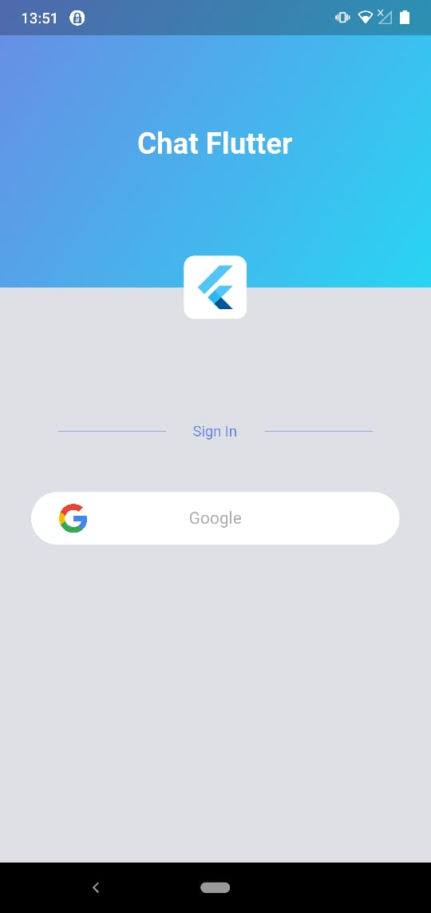
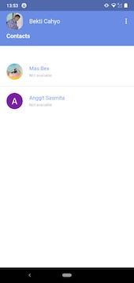
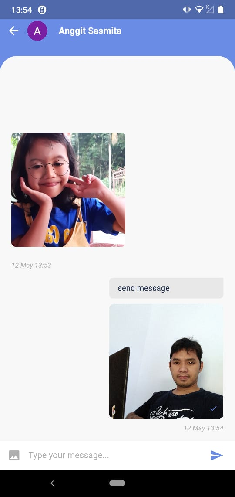

# ChatFlutter

Realtime Chat application using FireStore and build with flutter

    

## Getting Started

to run this project

```
  flutter pub get

  flutter run

```


## List of libraries in this project
* [firebase_auth](https://pub.dev/packages/firebase_auth)
* [google_sign_in](https://pub.dev/packages/google_sign_in)
* [cloud_firestore](https://pub.dev/packages/cloud_firestore)
* [firebase_storage](https://pub.dev/packages/firebase_storage)
* [fluttertoast](https://pub.dev/packages/fluttertoast)
* [shared_preferences](https://pub.dev/packages/shared_preferences)
* [image_picker](https://pub.dev/packages/image_picker)
* [cached_network_image](https://pub.dev/packages/cached_network_image)
* [intl](https://pub.dev/packages/intl)
* [progress_dialog](https://pub.dev/packages/progress_dialog)
* [photo_view](https://pub.dev/packages/photo_view)

A few resources to get you started if this is your first Flutter project:

- [Lab: Write your first Flutter app](https://flutter.dev/docs/get-started/codelab)
- [Cookbook: Useful Flutter samples](https://flutter.dev/docs/cookbook)

For help getting started with Flutter, view our
[online documentation](https://flutter.dev/docs), which offers tutorials,
samples, guidance on mobile development, and a full API reference.
